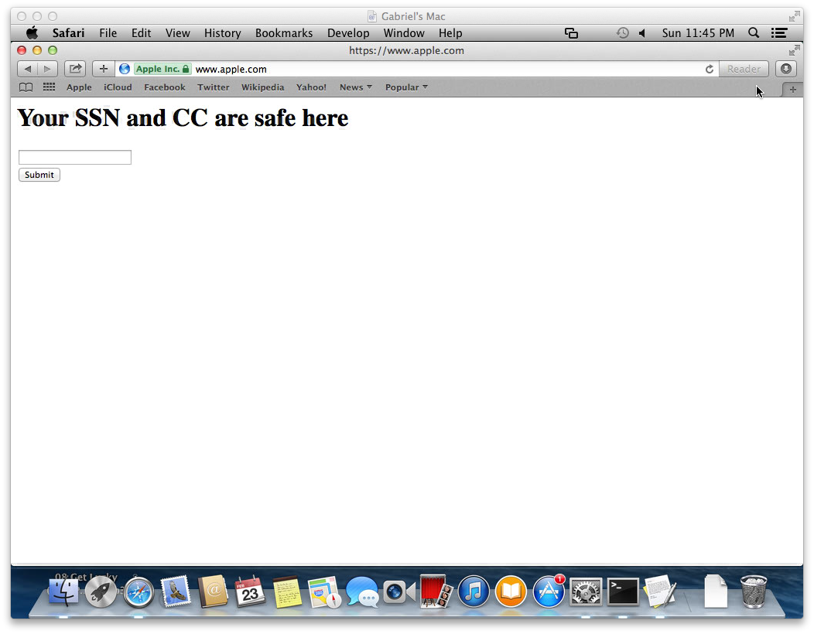

# OS X/iOS SSL Flaw POC

## Overview

This repository contains some Go code that demonstrates the recently discovered
SSL verification vulnerability in iOS and OS X.

* [Apple Update Announcement](http://support.apple.com/kb/HT6147)
* [Adam Langley's writeup](https://www.imperialviolet.org/2014/02/22/applebug.html)

## Usage

```
$ git clone https://github.com/gabrielg/CVE-2014-1266-poc.git
$ cd CVE-2014-1266-poc
$ go build main.go
$ ./main

# In another terminal
$ cd CVE-2014-1266-poc
$ go run http_server.go
```

Then set the proxy on a vulnerable machine to point at port 8080 on the machine
running the proxy server. HTTPS requests will be intercepted and redirected to
the HTTP server listening on the UNIX domain socket that the proxy makes
connections to.



---

Pass the time with some reading over at [gironda.org](http://www.gironda.org).
